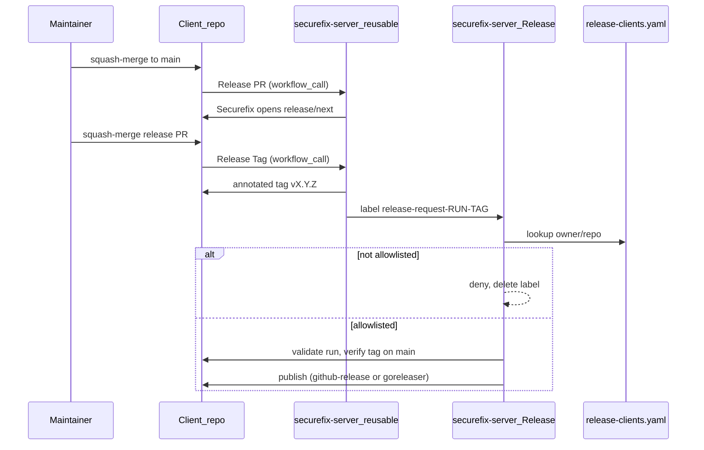

# Client releases

Canonical specification for how `civitaspo/*` client repositories prepare versions, request privileged publish, and approve pull requests through this server.

Privileged publish (GitHub Release / GoReleaser / GPG) runs **only** in `civitaspo/securefix-server` under the `main` environment. Clients never hold those secrets; they only create tags and request work via labels.

## Architecture



### Trust boundaries

| Layer | Runs where | Secrets / policy |
| --- | --- | --- |
| Thin wrappers | Client repo | Triggers only; pin reusable SHA |
| Reusable workflows | Defined here, executed as caller | Client App ID + server name hardcoded; needs `SECUREFIX_CLIENT_PRIVATE_KEY` from caller |
| `Release` workflow | This repository | Server App + publish secrets (`environment: main`); allowlist gate |
| Approve | Client requests label; this repo approves | Single shared committer / actor allowlist in workflows here |

Clients cannot publish by calling a reusable “publish” job. They can only create a `release-request-*` label that this server may honor.

## End-to-end flow (per client)

1. Commits land on client `main` (squash-merge).
2. **Release PR** (`reusable-release-pr.yml`) runs git-cliff, writes `.release-version` / `CHANGELOG.md`, and if present updates `dbt_project.yml` / `pyproject.toml`, then opens or updates `release/next` via Securefix.
3. **Release PR Sync** keeps the open `release/next` PR title/body aligned with `.release-version`.
4. A human squash-merges `chore(release): vX.Y.Z`.
5. **Release Tag** creates annotated tag `vX.Y.Z` on the merge commit and creates a `release-request-*` label on this server.
6. **Release** on this server validates the request and publishes according to the allowlist `publish` strategy.

Fork PRs are rejected at tag time (`head.repo.full_name` must equal `github.repository`).

## Allowlist (`release-clients.yaml`)

[`release-clients.yaml`](../release-clients.yaml) is the **only** gate for which repositories may publish.

```yaml
clients:
  - repository: civitaspo/example-package
    publish: github-release   # or goreleaser
```

Rules:

- Exact `owner/repo` match only — **no wildcards**.
- Repositories not listed are denied; the request label is deleted.
- Adding or changing a client requires a PR to this repository (code review = trust boundary).
- Schema is intentionally thin: `repository` + `publish` only.
- Go / GoReleaser / mise CLI / action versions are **pinned constants** in workflows (not floating `latest`); Renovate bumps them.

### Publish strategies

| `publish` | Behavior |
| --- | --- |
| `github-release` | Draft GitHub Release → publish once (immutable-release friendly) |
| `goreleaser` | Import GPG from `main` environment, run GoReleaser |

For `goreleaser`, `main` must provide `TERRAFORM_PROVIDER_GPG_PRIVATE_KEY` and `TERRAFORM_PROVIDER_GPG_PASSPHRASE`.

The server GitHub App needs `actions: read`, `contents: write`, and `pull_requests: read` on each allowlisted client.

## Label contract

Unified prefix for all clients:

| Field | Format |
| --- | --- |
| Name | `release-request-<run_id>-<tag>` (example: `release-request-123-v1.2.3`) |
| Description | `owner/repo/run_id/tag/sha` (preferred) |

Also accepted (legacy fallbacks inside the same unified workflow):

- `owner/repo/run_id`
- `owner/repo/run_id/tag`

Constraints:

- Referenced Actions run must be named **Release Tag**, same repository (no fork), and `queued` / `in_progress` / `completed+success`.
- Tag must be semver with a leading `v` (example: `v1.2.3`).
- Tag commit must equal the expected merge SHA and be an ancestor of `main`.
- Prefer including the squash-merge commit SHA: on `pull_request` closed, `workflow_run.head_sha` is the PR head (`release/next`), not the merge commit on `main`.
- If the description with SHA would exceed GitHub’s **100-character** label description limit, omit the SHA; the server resolves it from the merged `release/next` → `main` PR (or uses `head_sha` for `workflow_dispatch`).

Old per-repo prefixes (`release-dbt-auth-*`, `release-dbt-iceberg-*`, `release-dbt-rap-*`, `release-tf-provider-*`) are **not** supported.

## Reusable workflows

Defined under [`.github/workflows/`](../.github/workflows/). Clients call them with a **commit SHA pin** and Renovate to bump.

| Workflow | Role |
| --- | --- |
| [`reusable-release-pr.yml`](../.github/workflows/reusable-release-pr.yml) | Version bump + Securefix `release/next` PR |
| [`reusable-release-tag.yml`](../.github/workflows/reusable-release-tag.yml) | Annotated tag + `release-request-*` label |
| [`reusable-release-pr-sync.yml`](../.github/workflows/reusable-release-pr-sync.yml) | Sync open release PR metadata |
| [`reusable-approve-request.yml`](../.github/workflows/reusable-approve-request.yml) | Request server-side PR approval |

Hardcoded in reusables (not client repository variables):

- Securefix **client** GitHub App ID: `3872492`
- Server repository name: `securefix-server`

mise **CLI** version is pinned inside the reusable; **tool** versions come from each client’s `mise.lock` after checkout.

If `dbt_project.yml` and/or `pyproject.toml` exist at the repository root, Release PR updates their `version` fields and includes them in the Securefix file list.

### Thin wrapper (client)

GitHub requires each caller to declare `on:` triggers. The caller job must also declare **`permissions` at least as wide as the reusable job** (otherwise Actions fails at startup with “nested job is requesting … but is only allowed … none”).

| Reusable | Caller job `permissions` |
| --- | --- |
| `reusable-release-pr.yml` | `contents: read`, `pull-requests: read` |
| `reusable-release-tag.yml` | `contents: write` |
| `reusable-release-pr-sync.yml` | `contents: read`, `pull-requests: write` |
| `reusable-approve-request.yml` | `contents: read`, `pull-requests: read` |

After a client request step finishes, the job **Summary** lists links to the follow-up workflow on `civitaspo/securefix-server` (exact run when resolvable, otherwise a filtered Actions view plus the workflow file).

Example for Release Tag:

```yaml
name: Release Tag

on:
  pull_request:
    types:
      - closed
  workflow_dispatch:
    inputs:
      merge_sha:
        description: Commit SHA to tag (defaults to main HEAD when empty)
        required: false
        type: string

permissions: {}

concurrency:
  group: release-tag-${{ github.event.pull_request.number || github.run_id }}
  cancel-in-progress: false

jobs:
  tag:
    permissions:
      contents: write
    uses: civitaspo/securefix-server/.github/workflows/reusable-release-tag.yml@<sha>
    with:
      merge_sha: ${{ inputs.merge_sha }}
    secrets:
      SECUREFIX_CLIENT_PRIVATE_KEY: ${{ secrets.SECUREFIX_CLIENT_PRIVATE_KEY }}
```

### Client configuration

| Required | Notes |
| --- | --- |
| Repository secret `SECUREFIX_CLIENT_PRIVATE_KEY` | Client GitHub App private key (per repo; account is a User, so no org secrets) |

Do **not** configure (removed from the shared design):

- `SECUREFIX_CLIENT_APP_ID`
- `SECUREFIX_SERVER_REPOSITORY`
- Approve policy vars (`SECUREFIX_APPROVE_ACTORS`, `SECUREFIX_ALLOWED_COMMITTERS`, …)

## Pull request approval

Single org-wide default (no per-repo approve config file yet):

Trusted actors / committers: `civitaspo`, `cursoragent`, `civitaspo-securefix-server[bot]`, `renovate[bot]`, `dependabot[bot]`.

- Clients call `reusable-approve-request.yml` (auto on trusted PR authors, or `/approve` comment from `civitaspo`).
- This server’s `Approve Pull Request` workflow consumes `approve-pr-*` labels and approves with `CIVITASPO_BOT_PR_APPROVE_TOKEN`.

Keep the reusable and [`approve.yml`](../.github/workflows/approve.yml) lists in sync when changing policy.

## Onboarding a new client

0. Run **Repo settings** (`workflow_dispatch`) for the new repository name if the GitHub repo/settings are not ready yet; add the name to [`repo-settings/allowlist.json`](../repo-settings/allowlist.json) for schedule coverage. Details: [repo-settings.md](repo-settings.md).
1. Open a PR here adding an explicit [`release-clients.yaml`](../release-clients.yaml) entry (`repository` + `publish`). Merge it.
2. Install the Securefix **server** and **client** GitHub Apps on the new repository (server app needs the permissions in the allowlist section above).
3. Add thin wrappers for the four reusables, pinned to a commit SHA of this repository that contains those workflow files, with caller job `permissions` from the table above.
4. Set repository secret `SECUREFIX_CLIENT_PRIVATE_KEY` only.
5. Enable Renovate (or equivalent) to bump `civitaspo/securefix-server` workflow pins.
6. Ensure `.release-version`, changelog tooling (`cliff.toml` / equivalent), and tag protection rules match other clients.

Until step 1 is merged, copied wrappers cannot publish even if they create labels.

## Securefix commit path (related)

Separate from publish: Securefix **commit** requests are still limited to client workflows named `CI`, `Lint`, and `Release PR`, and validated by [`securefix-config.yaml`](../securefix-config.yaml). See the root [README](../README.md).

## Deferred

- **1Password Credential Broker** for `SECUREFIX_CLIENT_PRIVATE_KEY` — requires a GitHub Organization + 1Password Business; not used while repos live under a User account.
- **Per-repository approve policy file** — revisit if maintainers diverge and a single default is no longer enough.
