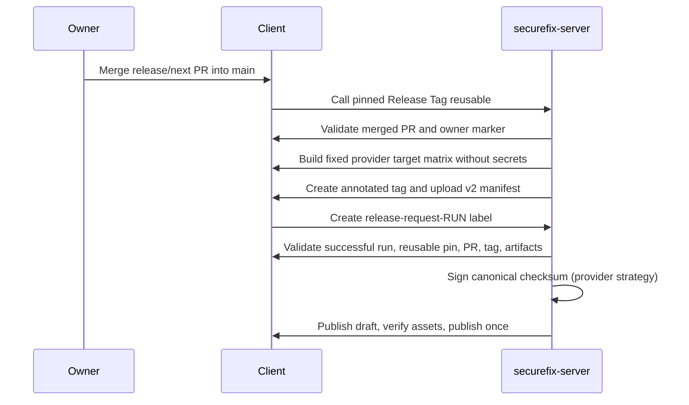

# Client releases

Release preparation runs in the client repository. The trusted Rust CLI and all privileged release operations run from this repository. Client code never receives the provider signing key or the publishing token.

## Flow and trust boundaries


```mermaid
sequenceDiagram
  participant Owner
  participant Client
  participant Server as securefix-server
  Owner->>Client: Merge release/next PR into main
  Client->>Server: Call pinned Release Tag reusable
  Server->>Client: Validate merged PR and owner marker
  Server->>Client: Build fixed provider target matrix without secrets
  Server->>Client: Create annotated tag and upload v2 manifest
  Client->>Server: Create release-request-RUN label
  Server->>Client: Validate successful run, reusable pin, PR, tag, artifacts
  Server->>Server: Sign canonical checksum (provider strategy)
  Server->>Client: Publish draft, verify assets, publish once
```

The server reads the active policy from its current `main` revision before privileged effects. The source Release Tag run must be successful, originate in the exact client repository, expose a confined caller workflow path, and reference the current `reusable-release-tag.yml` revision. For PR runs, the run SHA must match the associated PR head SHA; the server reads the caller workflow from the PR's base SHA, which must be on the default branch, and requires its reusable call to pin the same current revision. Owner-dispatched retries read the workflow at the run SHA and require that SHA on the default branch. The v2 manifest binds its run ID/attempt, runtime revision, release PR, merge commit, tag, and provider artifact ID. The PR must be merged `release/next` → `main` by the server bot. The server also reads `.release-version` from the merged commit and requires it to match the tag. Sensitive owner authorization is represented by a server-authored marker bound to the exact PR head SHA.

The build job compiles the fixed provider target matrix from the validated merge commit. It has no app token or signing key. The signer receives the already-built release bundle and a read-only server token for current-runtime and artifact provenance checks; it uses public client API data for release validation and has no client repository credential. It verifies exact filenames, archive structure, and hashes, generates canonical SHA256SUMS, and verifies the signature against the configured signing fingerprint before packaging it. If a retry finds a signature already uploaded to the same draft release, preflight downloads that exact asset, binds its digest and release ID into the short-lived plan, and the signer reuses those bytes only after checking the digest and verifying the signature over the regenerated checksum file. This preserves the signature bytes across partial uploads even though a fresh OpenPGP signature can differ. Unexpected, duplicate, mismatched, oversized, or unverifiable draft assets stop the run for inspection. The signer never loads client GoReleaser config, hooks, scripts, or executables. The publisher receives the signed bytes and a client contents-write token, but no GPG key. Existing published assets are never overwritten.

## Client policy and strategies

[`policy.json`](../policy.json) is the exact allowlist and strategy source. Supported strategies are `github-release` and `terraform-provider`; no client-provided release configuration is evaluated. A policy change requires review and a merge to this repository.

For `terraform-provider`, the server builds 13 ZIP assets using Go 1.26.5 and fixed Go build flags/targets. Each ZIP contains exactly `CHANGELOG.md`, `LICENSE`, `README.md`, and `${project}_v${version}` (with `.exe` on Windows); this matches the existing Sigma provider archive contract. Asset names are `${project}_${version}_${os}_${arch}.zip`, and the manifest is `${project}_${version}_manifest.json`. The server generates `${project}_${version}_SHA256SUMS` for all ZIPs and the manifest and its detached `.sig`. These names and archive contents are part of the Terraform Registry compatibility contract.

## Client wrappers

Pin each reusable to a full commit SHA and give its caller the minimum `permissions` shown here:

| Reusable | Caller permissions |
| --- | --- |
| `reusable-release-pr.yml` | `contents: read`, `attestations: read`, `pull-requests: read` |
| `reusable-release-pr-sync.yml` | `contents: read`, `attestations: read`, `pull-requests: write` |
| `reusable-release-tag.yml` | `contents: write`, `attestations: read`, `pull-requests: read`, `issues: write` |

A release PR wrapper passes `SECUREFIX_CLIENT_PRIVATE_KEY` and may provide an explicit version. The Rust CLI updates `.release-version`, `CHANGELOG.md`, and supported root package version metadata before Securefix opens or updates `release/next`.

```yaml
name: Release PR
on:
  push:
    branches: [main]
  workflow_dispatch:
    inputs:
      version:
        description: Explicit version without v; empty uses git-cliff
        required: false
        type: string
permissions: {}
jobs:
  prepare:
    permissions:
      contents: read
      attestations: read
      pull-requests: read
    uses: civitaspo/securefix-server/.github/workflows/reusable-release-pr.yml@<full-commit-sha>
    with:
      version: ${{ inputs.version }}
    secrets:
      SECUREFIX_CLIENT_PRIVATE_KEY: ${{ secrets.SECUREFIX_CLIENT_PRIVATE_KEY }}
```

The Release Tag reusable runs after a merged release PR. It accepts no SHA or tag override. For a retry, dispatch the client repository's wrapper with the already-merged `release_pr_number`; the owner, merge state, base/head branches, server-bot merger, owner marker, and exact source revision are checked again. A wrapper can expose this input as follows:

```yaml
name: Release Tag
on:
  pull_request:
    types: [closed]
  workflow_dispatch:
    inputs:
      release_pr_number:
        description: Merged release/next PR to retry
        required: true
        type: number
permissions: {}
concurrency:
  group: release-tag-${{ github.event.pull_request.number || inputs.release_pr_number }}
  cancel-in-progress: false
jobs:
  tag:
    if: github.event_name == 'workflow_dispatch' || (github.event.pull_request.merged && github.event.pull_request.head.ref == 'release/next' && github.event.pull_request.head.repo.full_name == github.repository)
    permissions:
      contents: write
      attestations: read
      pull-requests: read
      issues: write
    uses: civitaspo/securefix-server/.github/workflows/reusable-release-tag.yml@<full-commit-sha>
    with:
      release_pr_number: ${{ inputs.release_pr_number }}
    secrets:
      SECUREFIX_CLIENT_PRIVATE_KEY: ${{ secrets.SECUREFIX_CLIENT_PRIVATE_KEY }}
```

The client app private key is used only to create a short-lived, server-repository issues-write token for the request label. The server creates a separate, repository-scoped client token for source/artifact reads and publication. Do not pass a client token or private key to the build job.

## Request label protocol

The label name is `release-request-<source_run_id>` and its description is exactly `<owner>/<repo>/<source_run_id>`. It is a locator only: the server does not trust a tag, SHA, strategy, or artifact ID from the label. Those values come from the source run and manifest after the server verifies the run and its artifacts.

The referenced source run must be named `Release Tag`, run in the exact allowlisted repository (not a fork), and finish successfully. Manual retries are accepted only when the triggering actor is the repository owner and the referenced workflow run is still pinned to the current server reusable. Request labels are removed after processing, including failed attempts.

## Onboarding

1. Add the exact repository and release strategy to [`policy.json`](../policy.json) in a reviewed PR.
2. Install the Securefix server app with `actions: read`, `contents: read/write` as appropriate, and pull request read access. The release workflow creates a token scoped to only the selected repository.
3. Add wrappers that pin the reusable workflows at full commit SHAs and grant only their listed permissions.
4. Store `SECUREFIX_CLIENT_PRIVATE_KEY` in the client repository and enable the server `main` environment with the release signing secrets needed by the provider strategy.
5. Require review for `release/next` → `main` and protect release tags. Keep the latest workflow pin current.

The `release/next` PR must contain `.release-version` and the release changelog. For Terraform provider clients, the checked-in `terraform-registry-manifest.json` is used as data only; it is copied into the release assets after the fixed build.

Immutable releases must be enabled for every release-capable repository, either directly or through the organization policy. The publisher checks `GET /repos/{owner}/{repo}/immutable-releases` before creating or changing a release and fails closed unless `enabled` is `true`. After publishing, it re-fetches the release and requires the expected tag, published state, and `immutable: true`. The publishing App token therefore needs the repository `Administration: read` permission in addition to its release contents permission. GitHub does not enable immutable releases by default.
